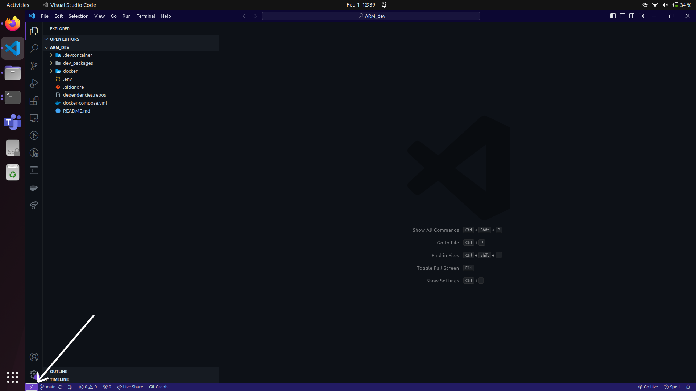
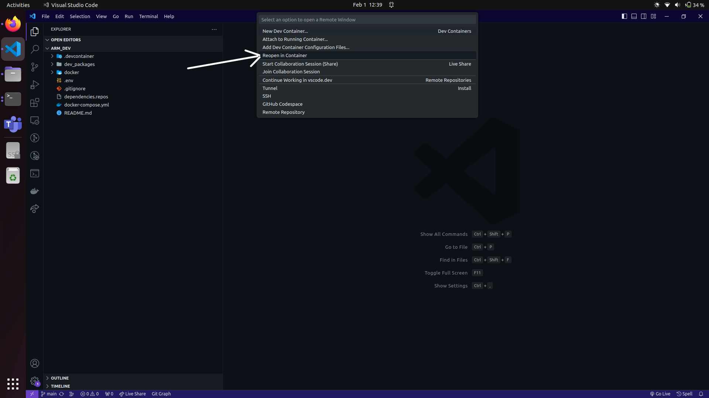

# Template for running ROS projects in docker containers

On the bottom left side of the window,
you can see the **"Open a remote window"** button
(the small rectangular button on the screenshot above).
Click on it.

VS Code will open a menu like the screenshot above.
Select **"Remote-Containers: Reopen in Container"**.
